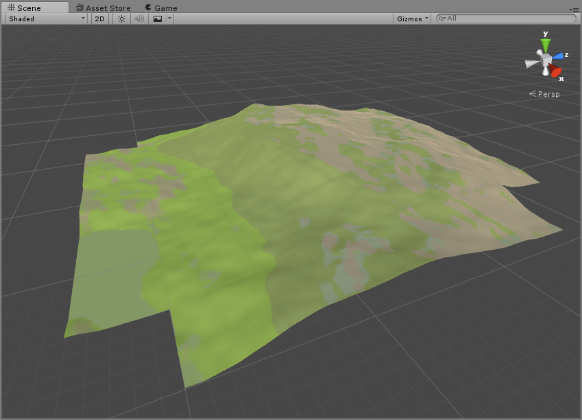
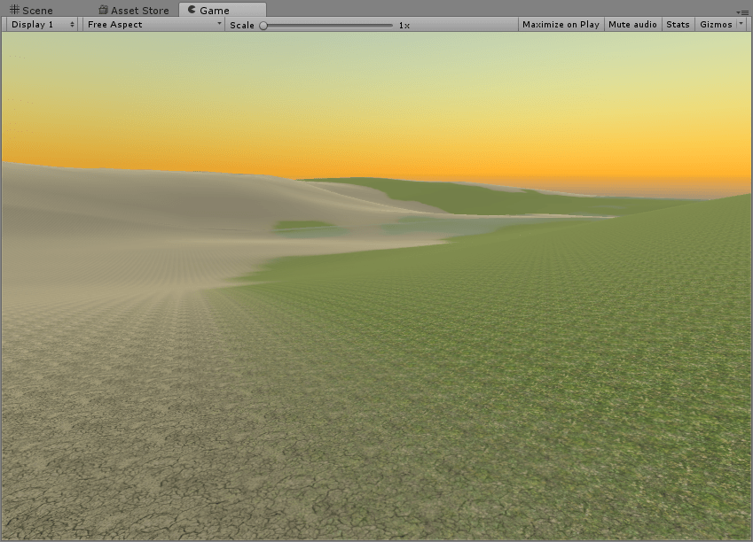

## Overview
This is a procedural terrain generator implemented in C# with the Unity 3D Game Engine. Terrain is generated around the player using a FBM (Fractal Brownian Motion) algorithm.

## Features
- Terrain splatmapping based on height and steepness of terrain
- Tiles are generated using a ThreadPool
- Generation around a specified gameobject
- Caching and retrieval of tiles surrounding the tracked gameobject
- Changeable generation seed / radius and terrain resolution / height

##Usage
Want to test out the generator for yourself? No problem. 

1. Clone or download the repository and drop the scripts into your project
2. Create a gameobject in your scene that contains the following scripts:
	- TilePool
	- TerrainSettings
	- UnityMainThreadDispatcher
3. Link the TerrainSettings component to the TilePool component
4. Add a tracked object to your scene. This can be a first person controller, an AI object, or simply a cube.
5. Play the scene

##Images

##Notes
- This generator works better with CPUs with a high core count due to the nature of the generation algorithm. More cores means more terrain can be generated at once because of the thread pool.
